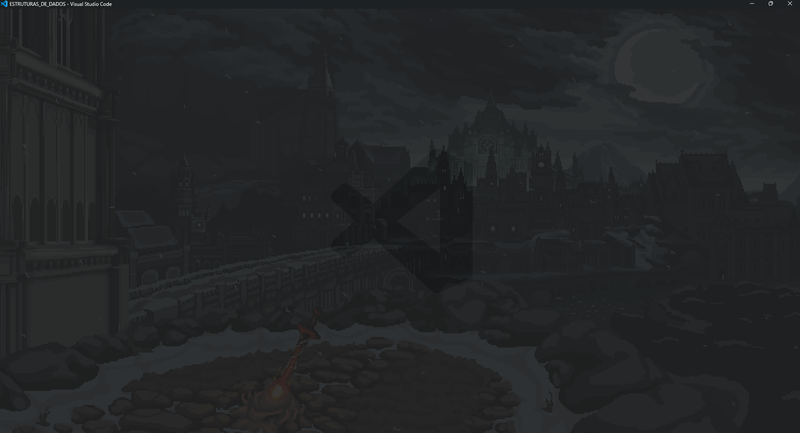

# 💻 VS Code — Perfil Minimalista 
-(by @Gengo250)
> Backup oficial e guia de instalação do meu ambiente **minimalista** no VS Code.  
> Foco: tela limpa, alto contraste, atalhos objetivos e extensões essenciais para produtividade.

<p align="center">
  <!-- Substitua pelas suas imagens reais -->
  <br/>
  <em>Editor limpo, sem distrações — personalize as imagens em <code>assets/screens/</code>.</em>
</p>

---

## 🗂️ Conteúdo do repositório

- `Myprofile.code-profile` — **Perfil exportado** do VS Code (inclui tema, layout, extensões e preferências compatíveis com perfis).
- `settings.json` — Ajustes finos de editor, terminal, aparência e comportamento.
- `extensions.txt` — Lista de extensões para instalação em lote.
- `snippets/` — Meus snippets pessoais (coloque aqui os arquivos `.code-snippets`).
- *(Opcional)* `assets/screens/` — **Prints de tela** usados neste README (crie esta pasta e adicione suas imagens).

> Dica: mantenha este repositório como a sua **fonte única de verdade**. Sempre que atualizar suas configs, exporte o perfil novamente e faça commit.

---

## ⚡ Instalação — 2 caminhos

### ✅ Opção A (recomendada) — **Importar o Perfil** (`Myprofile.code-profile`)

**GUI do VS Code**  
1. Abra o VS Code → `Ctrl/Cmd + Shift + P` → **Profiles: Import Profile…**  
2. Selecione o arquivo `Myprofile.code-profile` deste repositório.  
3. Confirme e ative o perfil importado.

> Observação: a importação do `.code-profile` é feita via interface do VS Code. Caso queira iniciar o VS Code diretamente com um perfil existente, você pode usar `code --profile "Nome do Perfil"` (se o perfil já existir na máquina).

**(Opcional) Abrir um projeto com o perfil por nome**
```bash
code ./meu-projeto --profile "Gengo Minimal"
```

---

### 🛠️ Opção B — **Aplicação manual** (arquivos + extensões)

#### 1) Baixe os arquivos
- `settings.json`
- `extensions.txt`
- (Se existir) a pasta `snippets/`

#### 2) Copie para a pasta de usuário do VS Code

**Windows**
```
%APPDATA%\Code\User\
```

**Linux**
```
~/.config/Code/User/
```

**macOS**
```
~/Library/Application Support/Code/User/
```

> Dica: se estiver usando **VS Code Insiders**, os caminhos mudam para `Code - Insiders`.

#### 3) Instale as extensões listadas

**Windows (PowerShell):**
```powershell
Get-Content .\extensions.txt | ForEach-Object { code --install-extension $_ }
```

**Linux/macOS (bash):**
```bash
xargs -L 1 code --install-extension < extensions.txt
```

Pronto! Ao reabrir o VS Code, você estará com o mesmo conjunto de extensões e preferências.

---

## 🎯 Filosofia do setup (minimalista)

- **Interface limpa**: foco no código, barras reduzidas e distrações mínimas.
- **Leitura confortável**: tipografia monoespaçada, espaçamento de linha agradável e highlights úteis.
- **Produtividade**: atalhos diretos, autoformat ao salvar e comportamento previsível.
- **Extensões curadas**: apenas o essencial para fluxo de estudo/trabalho.

> Para ver **100% das preferências**, abra o `settings.json` — lá estão os detalhes que controlam editor, terminal, formatação, breadcrumbs, minimap, etc.

---

## 🔁 Atualizações & versão do VS Code

- Sempre que mudar seu ambiente, **exporte novamente** o perfil e atualize este repositório.
- Para consistência, mantenha no topo deste arquivo a versão de VS Code que você usa com mais frequência.

```
VS Code estável: 1.xx.x
```

---

## ❓ FAQ rápido

**Q. Preciso do “code” no terminal para instalar extensões?**  
Sim. No macOS use `Shell Command: Install 'code' command in PATH` pela Paleta de Comandos. No Windows e Linux geralmente o `code` já fica disponível ao instalar.

**Q. Posso sobrescrever o perfil atual via CLI?**  
Atualmente, a importação do `.code-profile` é feita pela interface gráfica. Pela CLI, você pode **abrir o VS Code apontando para um perfil existente** via `--profile "Nome"`.

**Q. Onde ficam os arquivos do usuário?**  
Nos caminhos de usuário listados na *Opção B* (variando por SO).

---

## 🧾 Licença

Este repositório contém **configurações pessoais**. Sinta-se à vontade para se inspirar e copiar, mas lembre-se de revisar cada opção para o seu contexto.

---

### 🧷 Links rápidos
- Perfil exportado: [`Myprofile.code-profile`](./Myprofile.code-profile)
- Preferências do editor: [`settings.json`](./settings.json)
- Lista de extensões: [`extensions.txt`](./extensions.txt)
- Snippets: [`snippets/`](./snippets/)
- Imagens: [`assets/screens/`](./assets/screens/) 

---

## 👤 Autor

**Miguel de Castilho Gengo**  
Estudante de Engenharia de Computação (PUC-Campinas) • Dev C/Java/Python • Robótica & Cibersegurança

**Links**
- GitHub: [@Gengo250](https://github.com/Gengo250)
- LinkedIn: [miguel-gengo-8157b72a1](https://www.linkedin.com/in/miguel-gengo-8157b72a1)
- E-mail: [miguelgengo28@gmail.com](mailto:miguelgengo28@gmail.com)

Se este setup te ajudou, deixa uma ⭐ no repositório e sinta-se à vontade para abrir uma *Issue* com sugestões.
